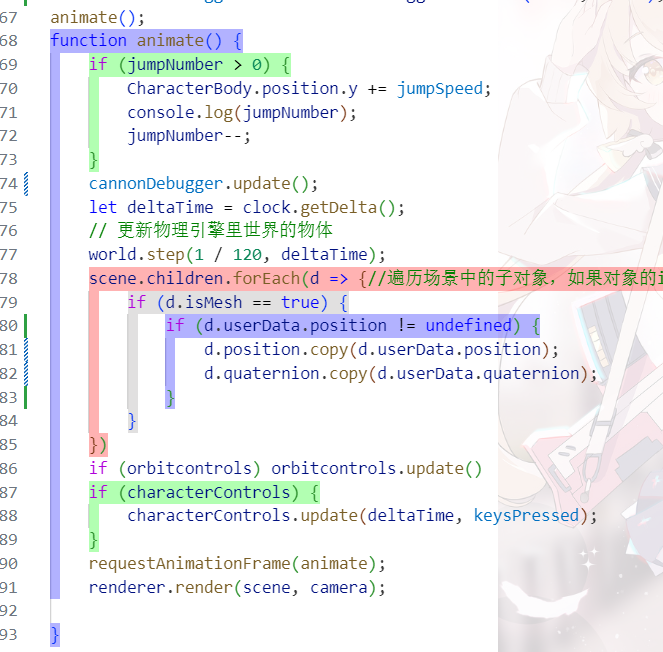
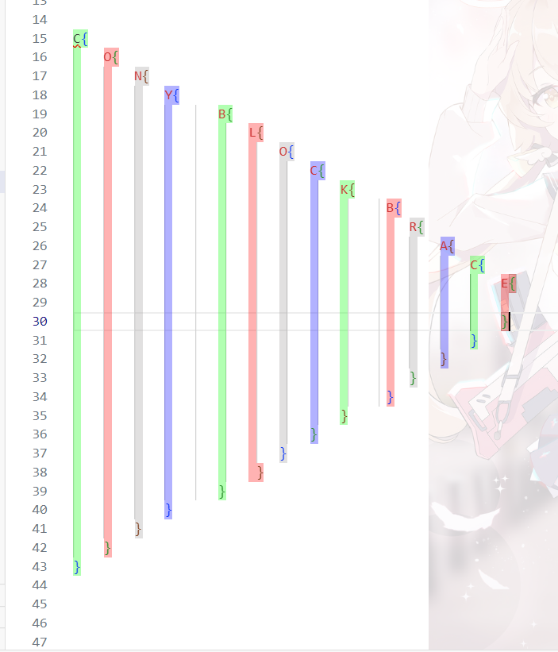
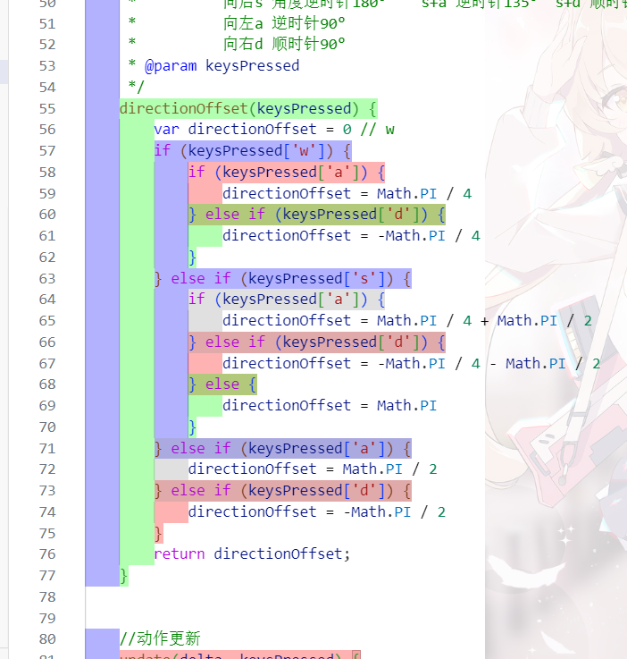
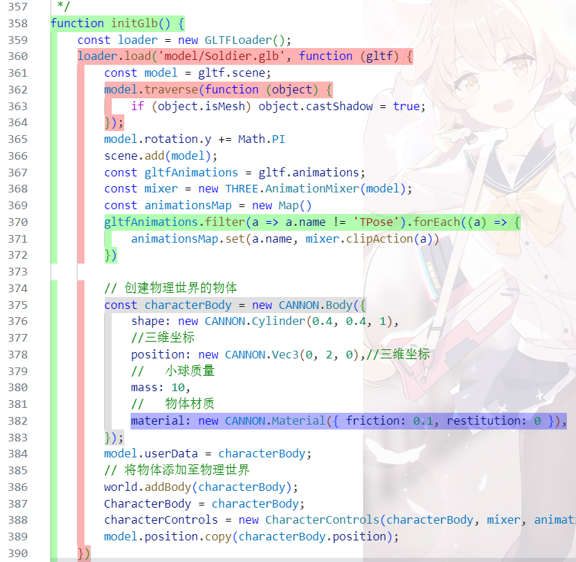
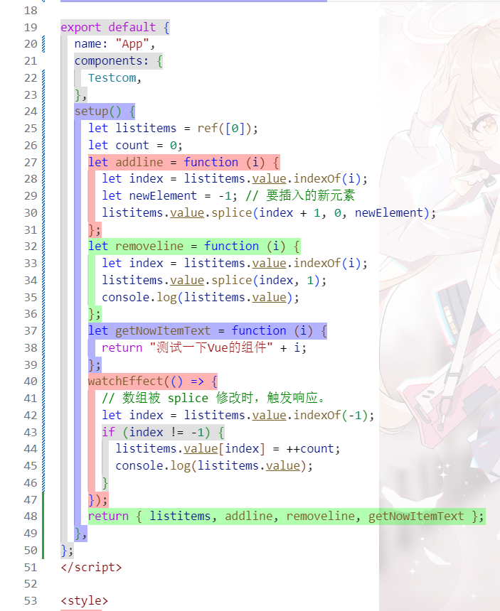
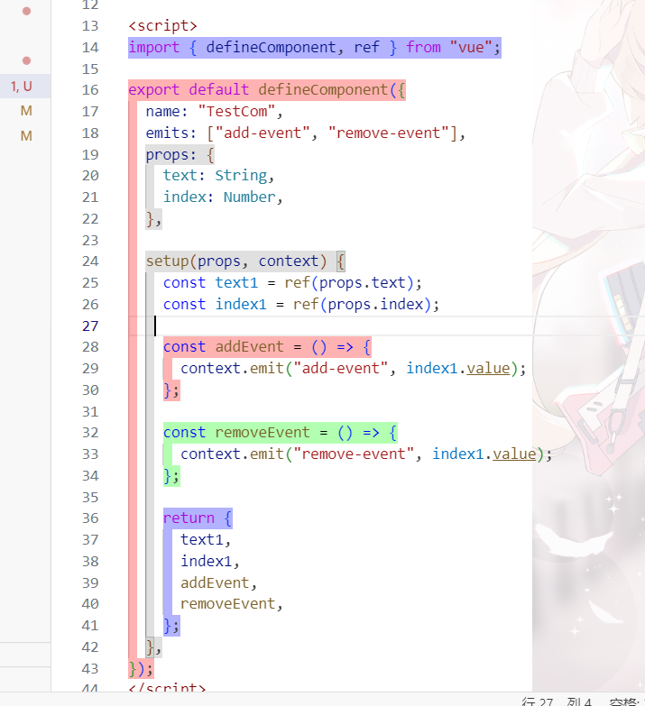
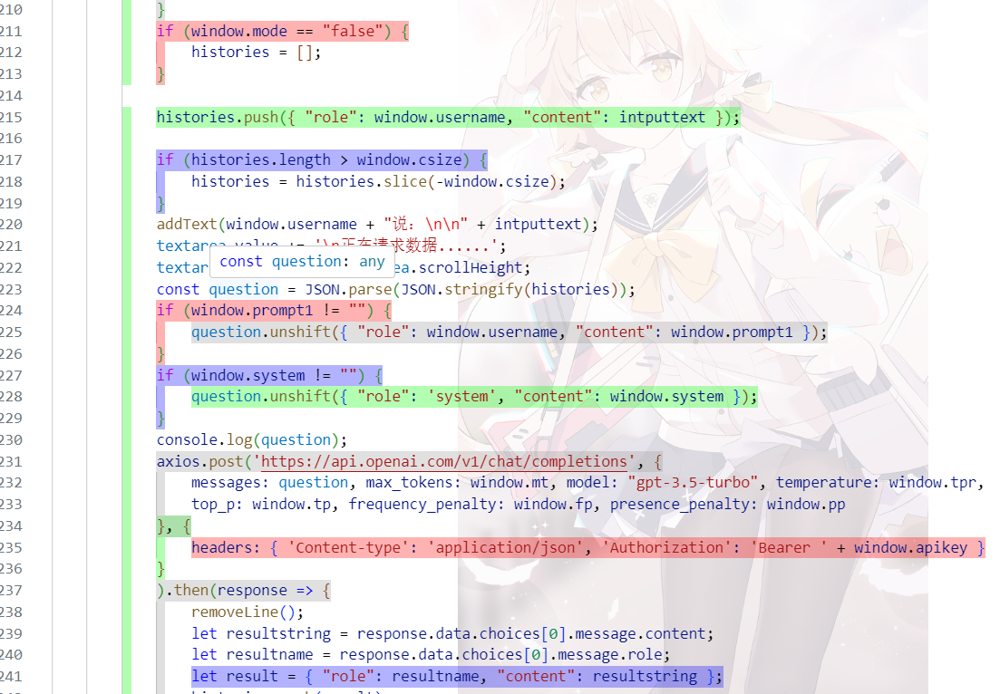
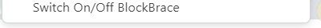

# ConyBlockBrace README

Cony Block Brace{}，A Java\javascript\C\CPP\Json Block Brace Highlighting Extension.

一个支持将Java、Javascript、C、C++程序语句中的大括号围起来的语句代码块高亮醒目地显示的插件，便于开发者审查阅览程序语句.

Github:https://github.com/sdsds222/ConyBlockBrace/
## Features

Cony Block Brace 本插件可以将花括号(大括号)构成的js语句块高亮显示,便于{}代码块的编辑与查看,支持Js、Ts、Json、Java、C、Cpp,从而实现可视化编程.本插件可以将花括号(大括号)构成的js语句块高亮显示,便于{}代码块的编辑与查看,支持Js、Ts、Json、Java、C、Cpp,从而实现可视化编程.This plugin can highlight JavaScript statement blocks composed of curly braces (curly braces) for easy editing and viewing of {} code blocks. It supports Js, Ts, Json, Java, C, and Cpp to achieve visual programming.

插件功能默认关闭，需要在右键菜单中激活，也可前往配置文件配置参数默认启动。

The function is disabled by default, which needs to be activated in the editor right-click menu, or you can go to the configuration file to 

插件使用效果演示图片:

右键菜单：(点击Switch On/OFF BlockBrace即可启用/停用本插件的代码高亮功能。)

## Requirements

## Extension Settings

Not Any Settings.

## Known Issues

NOT.

## Release Notes

新版本发布

### 1.0.0
A New Extension. 
### 1.1.5
修改插件接收页内容
**Enjoy!**
